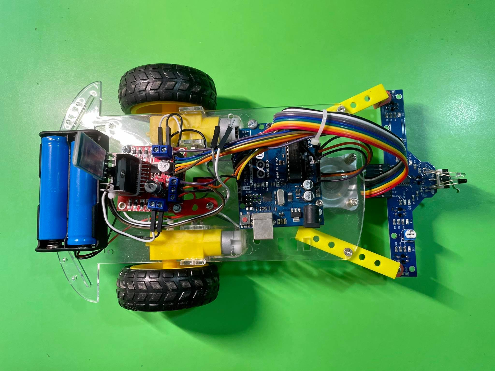
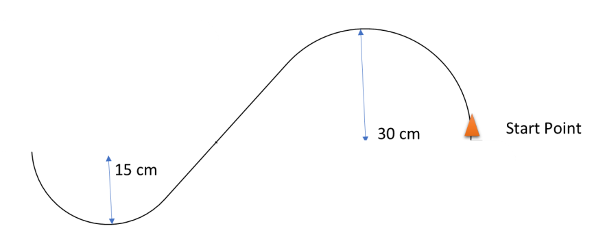
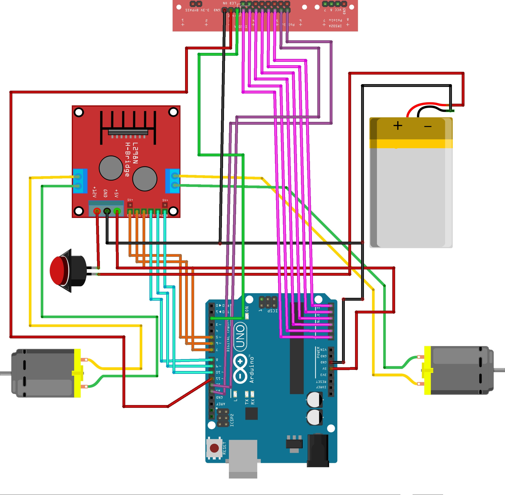
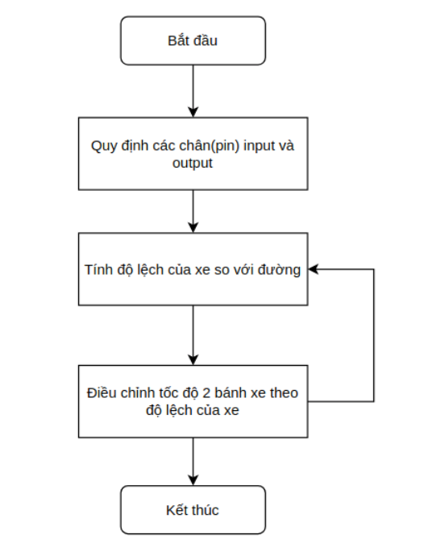

# Project - Quản trị dự án hệ nhúng theo chuẩn kỹ năng ITSS

    

## Thiết kế robot dò đường
---

### 1. Quỹ đạo di chuyển của robot

    

---
### 2. Các module phần cứng sử dụng

| STT | Tên thiết bị |
|---|---|
| 1 | Arduino UNO |
| 2 | Module dò line (5 cặp hồng ngoại) |
| 3 | Module điều khiển động cơ LD298 |
| 4 | Khung xe Robot (Khung xe, bánh xe, motor) |
| 5 | Module Bluetooth HC-05 |
| 6 | Pin sạc 18650 (2650mAh) |
| 7 | Khay Pin + Bộ sạc Pin |
| 8 | Dây cắm board |

---
### 3. Thiết kế mạch phần cứng

    

Sơ đồ lắp ghép mạch phần cứng được thể hiện như hình bên trên, cụ thể như sau:
- Các cổng đầu ra của cảm biến dò line 5 led được gắn thứ tự lần lượt vào các cổng A0, A1, A2, A3, A4 trên mạch Arduino Uno
- Cổng 11 trên mạch Arduino nối với cổng EnA của mạch điều khiển động cơ để điều khiển tốc độ của bánh phải
- Cổng 10 trên mạch Arduino nối với cổng EnB của mạch điều khiển động cơ LD298
để điều khiển tốc độ của bánh phải
- Các cổng 8, 9, 12, 13 trên mạch Arduino nối với các cổng input của mạch điều khiển động cơ LD298
- Các cổng output của mạch điều khiển động cơ LD298 nối với 2 motor để điều khiển bánh xe trái và phải
- Nguồn điện: Cực dương nối với cổng (+5V) trên mạch Arduino và mạch điều khiển động cơ LD298, cực âm nối với ground để cấp nguồn cho mạch hoạt động.

---

### 4. Thiết kế phần mềm

Lưu đồ thuật toán xử lý trong mã nguồn:

    

---
### 5. Kết luận

#### Cách 1: Thử nghiệm lập trình với phương pháp điều khiển tín hiệu xung PWM

> Source code: ./code_normal_S_clean

**Nhận xét:** Xe chạy bám đường và quay đầu ổn định. Tuy nhiên, xe vẫn lắc nhẹ khi di chuyển.

#### Cách 2: Thử nghiệm lập trình hiệu chỉnh tham số PID

> Source code: ./code_pid

**Nhận xét:** Xe chạy ổn định và không rung lắc trên đường chữ S. Tuy nhiên, chưa tối ưu được để xe có thể quay đầu trở lại đường đi.
