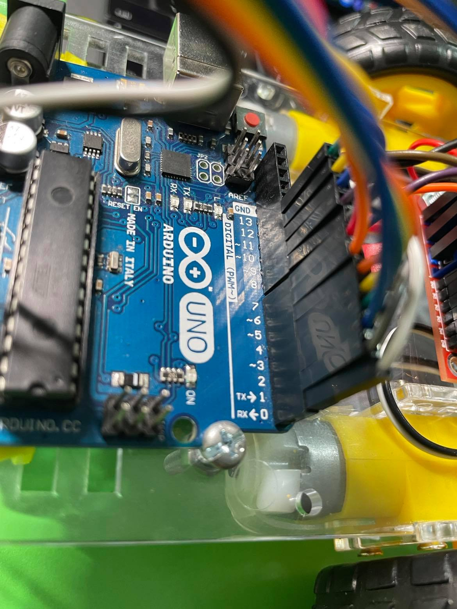

# Project - Quản trị dự án hệ nhúng theo chuẩn kỹ năng ITSS

## Phần 1: Xây dựng xe dò Line 
Chú ý: khi Code sẽ đặt tên các chân là #DEFINE xxx 

Sơ đồ đấu mắc chân: 

* Kết nối với động cơ: 
	- Chân 2,3 (IN 4,3): động cơ bên phải 
	- Chân 4,5 (IN 2,1): động cơ bên trái 

* Kết nối với bộ cảm biến dò line:
	- Chân 6 -> CLP
	- Chân 7 -> Near 
	- Chân 8, 9, 10, 11, 12 -> Cảm biến S1, S2, S3, S4, S5

* kết nối với bộ Bluetooth:
	- Chân 0: RX <- 0
	- Chân 1: TX -> 1

